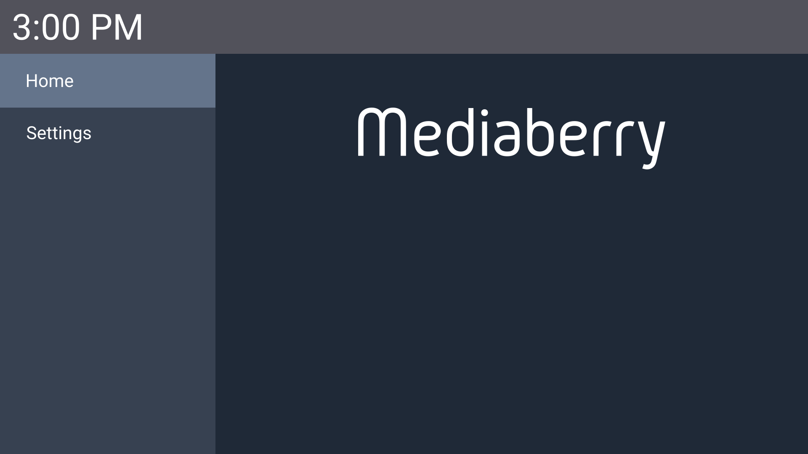

# libmediaberry

libmediaberry is the core library for Mediaberry which handles graphics, input, sound, etc.

Since there is no implementation code yet, here's an image of what I'm trying to make it look like:

